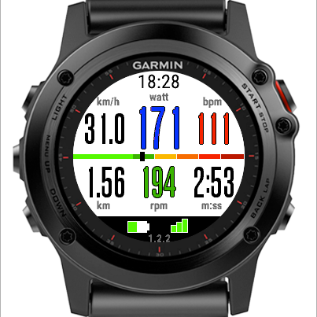
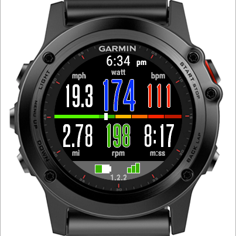

# ActivityMonitor

 

This is free a Data Field for the Fenix 3 that shows multiple values on a single field. 
Focus of this Data Field is the representation of the control of training with heart rate, power(later release) and Cadence.
ActivityMonitor is open source and its code resides at github: https://github.com/Bimtino/ActivityMonitor.git

The Data Field is based on an other Data Fields. Special thanks for developers of the following ConnectIQ projects:
https://apps.garmin.com/en-US/apps/aacfc2de-b61e-40cc-a83d-52f46f9d263d

Release versions are published in the [Garmin App Store](https://.......)

===============================================

## Feedback 
https://forums.garmin.com/showthread.php?........

===============================================

## Features
* TIME: 12/24h mode based on system settings.
* SPEED: speed in km/h or mph based on system settings (as average of the last 10 values)
* HEART RATE: current pulse in bpm.
* AVG SPEED: average speed over the whole activity.
* DISTANCE: elapsed distance in km or miles based on system settings.
* CADENCE: cadence in rpm.
* DURATION: duration of the activity in [hh:]mm:ss
* GPS: green/dark green bars for poor/acceptable/good signal, gray if no signal.
* battery: visualization of battery percentage as indicator bar. 
  If battery value is lower than 30 the indicator bar gets orange. If value is lower than 10% the exact value will be shown and the indicator bar turns red.
* unit system in use: MKS unit system will be shown when metric system is set in the settings, Miles units if statute (imperial) units are configured.
* use bright or dark color scheme based on the background color setting of the app (Settings/Apps/Run/Background Color).
  needs at least a firmware with SDK 1.2 compatibility (otherwise bright scheme is always used).

===============================================

## Install Instructions
A Data Field needs to be set up within the settings for a given activity.

* Long Press UP
* Settings
* Apps
* Bike
* Data Screens
* Screen N
* Layout
* Select single field
* Field 1
* Select ConnectIQ Fields
* Select ActivityMonitor
* Long Press DOWN to go back to watch face

===============================================

## Usage
Start activity.
Hopefully you see the ActivityMonitor data field and can read the values.

===============================================

## Changelog 1.0.3
* minor UI redesign for better reading

## Changelog 1.0.2
Initial release of the activity monitor with following values:
* Time of day (12/24 hours mode)
* Current Speed (average over the last 10 values)
* Heart Rate
* Average Speed
* Distance
* Cadence
* Timer
* Battery Status
* GPS Status 
